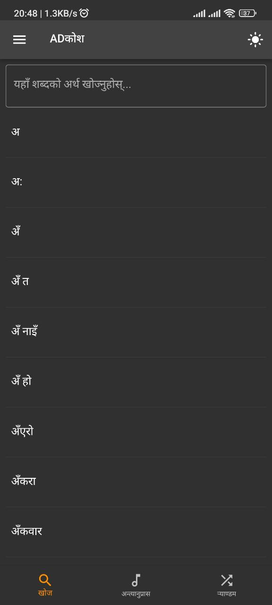
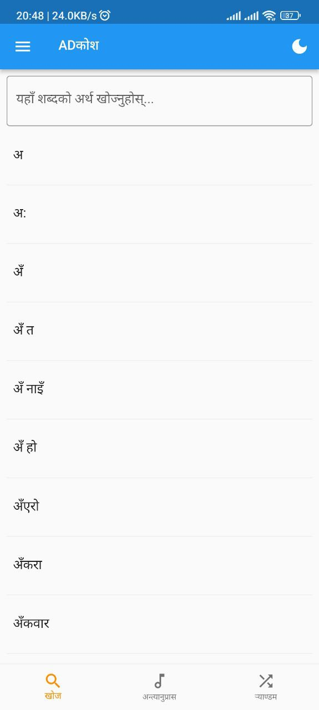
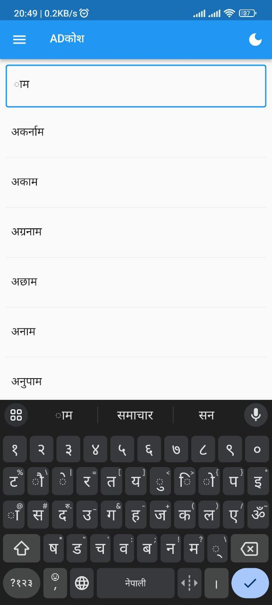
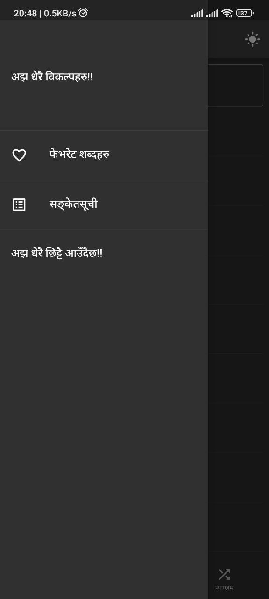
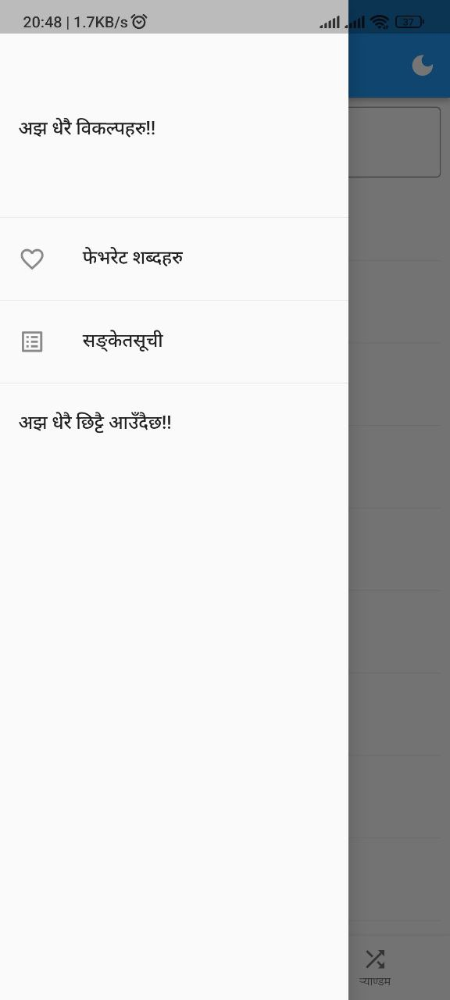

# ADKosh
A Nepali Dictionary (एउटा नेपाली शब्दकोश)
This is a Work In Progress

## Features:
1. Normal Word Search (शब्दको अर्थको खोजी)
2. Rhyme Search (अन्त्यानुप्रास मिल्ने शब्दको खोजी)
3. Random Word Shuffle (र्याण्डम शब्दको विबरण)
4. Favorite Word (मन परेको शब्दलाई चिन्ह लगाउन मिल्ने)

## Features coming soon:
* Word of the day as a Notification
* Nepali Grammar Rules and Lessons
* Nepali Literature Guide
* And so much more

## Getting Started
Install the APK package from [here](https://www.anupamdahal.com.np/tech). And Enjoy

## To build it yourself
1. Get the Flutter Developement Environment setup. There's lots of resource available online for this.
2. Clone the repo
3. You'll need the shabdakosh database before you can build your own app. Please ask for the database (email me or something). I have not included the file in the repo in case someone files a DMCA take down request and the whole repo gets taken down.
4. Once you have the shabdakosh file, place it in the directory `assets/db/shabdakosh.sqlite3`.
5. Now build your app. 
6. Enjoy

## Screenshots

## Database structure
The databse contains two tables: `corpora`, `meanings`.

### Table `corpora`
| id | word | favourite |
| ------ | ------ | ------ |
| 33018 |	अ	|  1  |
| 33019 |	अ:	|  0  |

I guess the table and the data types are self-explanatory.

### Table 'meanings'
| id | grammar | etymology | corpora_id | senses |
| -- | ------- | --------- | ---------- | ------ |
| 4 | पूस. | 33018 | NULL | ['शब्दका अगाडि लागेर अभाव, भिन्नता, विपरीतता आदि बुझाउने पूर्वसर्ग।'] |
| 5 | नि.| 33018 | NULL | ['दिक्क लागेको अवस्थामा व्यक्त गरिने उपेक्षा भाव।'] |
| 6 | नि.| 33019 | NULL | ['निकै; अति।'] |
| 7 | नि.| [प्रा. आम< सं. आम्] | 33020 | ['स्वीकार, सम्झना, आश्चर्य, उपेक्षा, प्रसन्नता, पीडा आदि भाव जनाउने; प्रायः वाक्यका अगाडि आउने शब्द।'] |

I guess this too is self explanatory.

## Contributing
I am accepting pull requests if you want to contribute.

Cheers!!!
