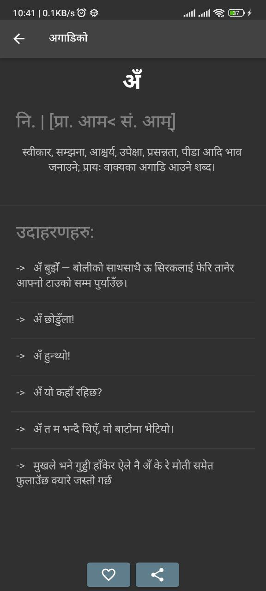
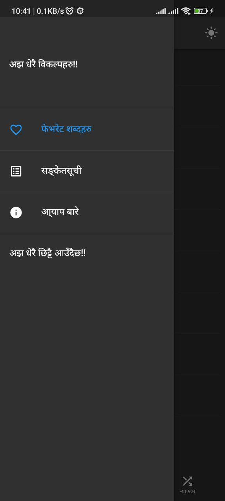
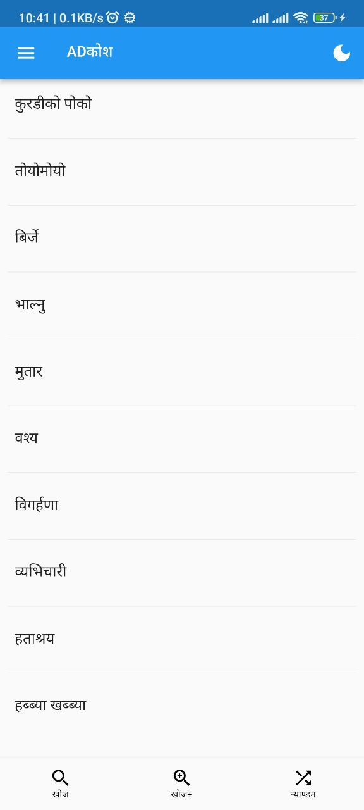
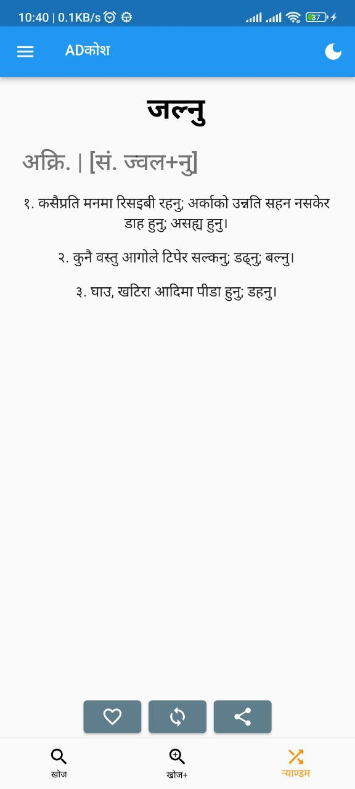
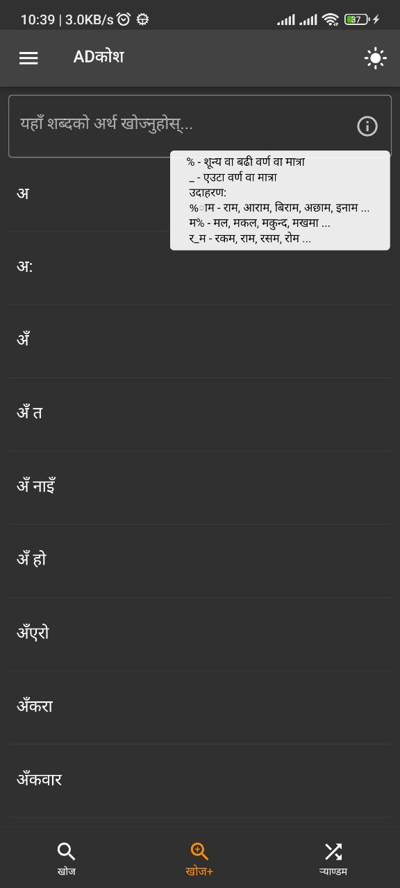
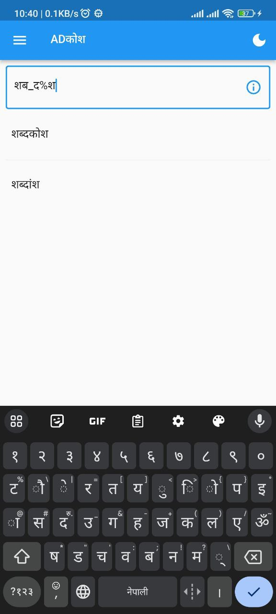
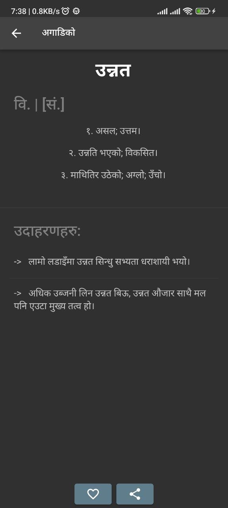
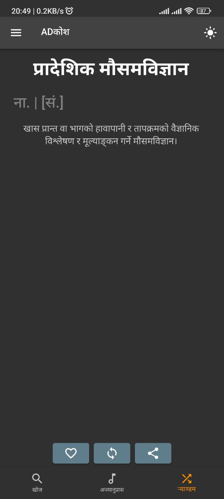
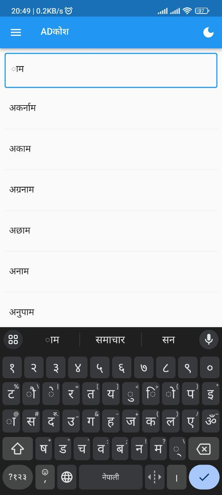

# ADKosh
A Nepali Dictionary (एउटा नेपाली शब्दकोश)

## Release Notes
### Version 3.0.0

| :exclamation:  This is very important: The Application Id of the app has been changed. What this means is if you had an older version of the app installed already, you will find that a new app with the same name has been installed. You can uninstall the older one safely. If this version is the first time installing your app, there is no need to do anything.   |
|-----------------------------------------|

* Features
    - Added advanced word search with wildcards
    - Improved search, checks both ह्रस्व and दीर्घ while searching, for example: searching फुल finds both फुल and फूल
    - Example usage of many words have been added
    - Added haptic feedback on button presses
* Fixes
    - Fixed blank screen bug if pressed back on Random Screen

* Other Changes
    - Added tooltips and helper icons
    - Added About App screen in the navigation drawer
    - Added App Index screen in the navigation drawer
    - Code Refactor and other UI/UX changes

## Features:
1. Normal Word Search (शब्दको अर्थको खोजी)
2. Rhyme Search (अन्त्यानुप्रास मिल्ने शब्दको खोजी)
3. Random Word Shuffle (र्याण्डम शब्दको विबरण)
4. Favorite Word (मन परेको शब्दलाई चिन्ह लगाउन मिल्ने)

## Features coming soon:
* Word of the day as a Notification
* Nepali Grammar Rules and Lessons
* Nepali Literature Guide
* And so much more

## Getting Started
Install the latest APK package from Releases Section of this repository. And Enjoy

## To build it yourself
1. Get the Flutter Developement Environment setup. There's lots of resource available online for this.
2. Clone the repo
3. You'll need the shabdakosh database before you can build your own app. Please ask for the database (email me or something). I have not included the file in the repo in case someone files a DMCA take down request and the whole repo gets taken down.
4. Once you have the shabdakosh file, place it in the directory `assets/db/shabda.sqlite3`.
5. Now build your app. 
6. Enjoy

## Screenshots
  
  
  

## Database structure
The databse contains three tables: `corpora`, `meanings`, `examples`.

### Table `corpora`
| id | word | favourite |
| ------ | ------ | ------ |
| 33018 |	अ	|  1  |
| 33019 |	अ:	|  0  |

I guess the table and the data types are self-explanatory.

### Table `meanings`
| id | grammar | etymology | corpora_id | senses |
| -- | ------- | --------- | ---------- | ------ |
| 4 | पूस. | 33018 | NULL | ['शब्दका अगाडि लागेर अभाव, भिन्नता, विपरीतता आदि बुझाउने पूर्वसर्ग।'] |
| 5 | नि.| 33018 | NULL | ['दिक्क लागेको अवस्थामा व्यक्त गरिने उपेक्षा भाव।'] |
| 6 | नि.| 33019 | NULL | ['निकै; अति।'] |
| 7 | नि.| [प्रा. आम< सं. आम्] | 33020 | ['स्वीकार, सम्झना, आश्चर्य, उपेक्षा, प्रसन्नता, पीडा आदि भाव जनाउने; प्रायः वाक्यका अगाडि आउने शब्द।'] |

I guess this too is self explanatory.

### Table `examples`
| id | corpora_id | usage |
|----|------------|-------|
| 5	| 33020 |	अँ त म भन्दै थिएँ, यो बाटोमा भेटियो। |
| 6	| 33020 |	मुखले भने गुड्डी हाँकेर ऐले नै अँ के रे मोती समेत फुलाउँछ क्यारे जस्तो गर्छ |
| 7	| 33053 |	लोग्नेले सुशीलाको सुकुमार गोलो गर्धनमा हात पुर्याएर अँगाल्यो। |
| 8	| 33053 |	भुटानले नेपाल र नेपाली मूलका भुटानीप्रति नकारात्मक दृष्टिकोण अँगाल्यो। |

This too is self explanatory. However, I must mention that not every word in the dictionary listing has usage examples. Further, the meanings of the words are taken from one source and the example usage are taken from another source. As a result, sometimes, there are usage examples of certain words that have extra meanings than the ones mentioned in the definitions. I'm planning to show definitions from both sources in the future. 

## Contributing
I am accepting pull requests if you want to contribute.

Cheers!!!
